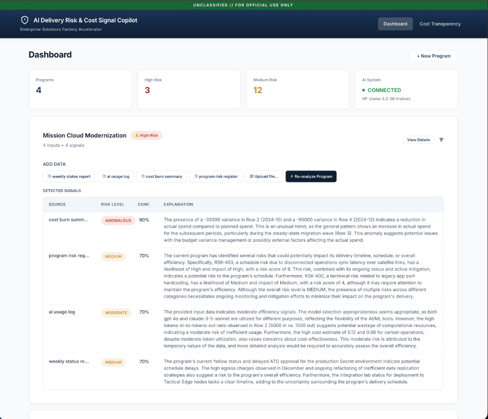
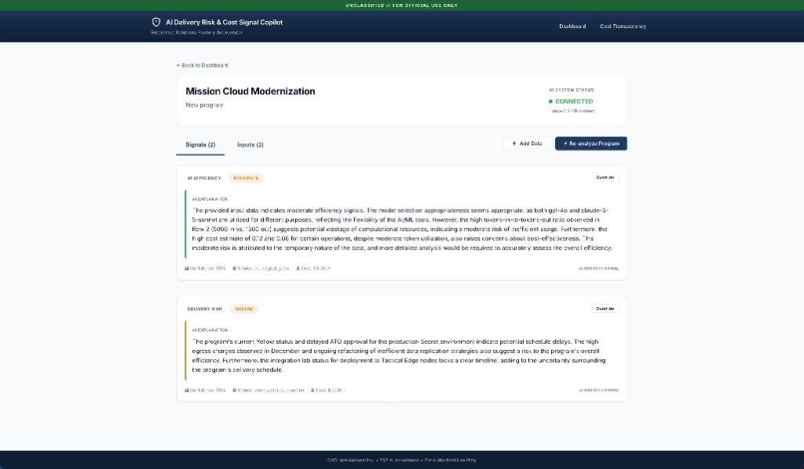
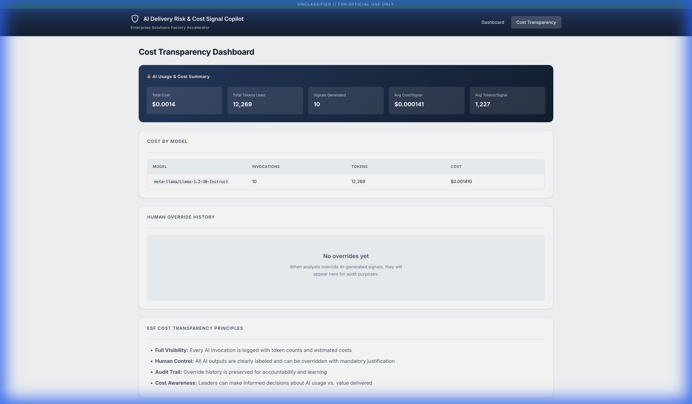

# CACI AI Delivery Risk & Cost Signal Copilot

An ESF-aligned AI accelerator that surfaces early delivery risk, cost anomalies, and AI usage efficiency signals across government programs.


## 🎯 Overview

This project is a **high-leverage Enterprise Solutions Factory (ESF) accelerator** designed to demonstrate rapid time-to-value, cost transparency, explainability, and human-in-the-loop decision support.

**Key Question Answered:** *"Are we trending toward risk or cost issues — and why?"*

### ✨ Key Features

| Feature | Description |
|---------|-------------|
| **AI-Powered Signal Generation** | Real-time risk and cost analysis using Meta's Llama 3.2 via Hugging Face |
| **RAG (Retrieval Augmented Generation)** | Semantic search with FAISS + sentence-transformers for intelligent context retrieval |
| **Live AI Connectivity Status** | Visual indicator showing real-time connection to inference providers |
| **Cost Transparency** | Token usage tracking and cost-per-signal metrics for complete visibility |
| **Human-in-the-Loop Controls** | Analyst overrides with mandatory justification for accountability |
| **Multi-Format Input Ingestion** | Support for CSV, TXT, and **PDF** uploads plus manual text entry |
| **Containerized Deployment** | Dockerfiles and docker-compose for PaaS-ready deployment |
| **Audit Trail** | Full history of AI outputs and human corrections |


---

## 📸 Screenshots

### Dashboard with AI Status
The main dashboard shows program health at a glance with a real-time AI connectivity indicator.


### Expanded Program View
Quick access to sample data upload and signal previews directly from the dashboard.



### Program Signals Detail
Detailed AI-generated signals with confidence scores, explanations, and cost metrics.



### Cost Transparency Dashboard
Complete visibility into AI usage, token consumption, and cost breakdown.



---

## 🏗️ Architecture

```
┌─────────────────────────────────────────────────────────────────────┐
│                           Frontend (React + Vite)                   │
│  ┌─────────────┐  ┌─────────────┐  ┌─────────────┐  ┌─────────────┐ │
│  │  Dashboard  │  │  Programs   │  │   Signals   │  │    Costs    │ │
│  └─────────────┘  └─────────────┘  └─────────────┘  └─────────────┘ │
└───────────────────────────────┬─────────────────────────────────────┘
                                │ REST API
┌───────────────────────────────▼─────────────────────────────────────┐
│                         Backend (FastAPI)                           │
│  ┌─────────────┐  ┌─────────────┐  ┌─────────────┐  ┌─────────────┐ │
│  │   Programs  │  │   Inputs    │  │   Signals   │  │  Overrides  │ │
│  │     API     │  │     API     │  │     API     │  │     API     │ │
│  └─────────────┘  └─────────────┘  └─────────────┘  └─────────────┘ │
└───────┬───────────────────┬───────────────────┬─────────────────────┘
        │                   │                   │
┌───────▼───────┐   ┌───────▼───────┐   ┌───────▼───────┐
│    SQLite/    │   │  Hugging Face │   │   Services    │
│  PostgreSQL   │   │ Inference API │   │     Layer     │
│   Database    │   │  (Llama 3.2)  │   │ (LLM, Costs)  │
└───────────────┘   └───────────────┘   └───────────────┘
```

---

## 🛠️ Tech Stack

| Layer | Technology | Purpose |
|-------|------------|---------|
| **Frontend** | React 18, Vite, React Router | Modern SPA with fast HMR |
| **Styling** | CSS Variables, Glassmorphism | CACI-inspired professional theme |
| **Backend** | FastAPI, Pydantic | High-performance async API |
| **ORM** | SQLAlchemy 2.0 | Database abstraction layer |
| **Database** | SQLite (default) / PostgreSQL | Persistent storage |
| **AI Model** | Meta Llama 3.2 3B Instruct | Signal generation via HF Router |
| **RAG/Embeddings** | FAISS, sentence-transformers | Vector search + embeddings |
| **API Protocol** | OpenAI-compatible Chat Completions | Industry-standard format |

---

## 🚀 Quick Start

### Prerequisites
- Python 3.9+
- Node.js 18+
- Hugging Face account (free tier works!)

### 1. Backend Setup

```bash
cd backend
python -m venv venv
source venv/bin/activate  # Windows: venv\Scripts\activate
pip install -r requirements.txt
python run.py
```

The API will be available at `http://localhost:8000`
- API docs: `http://localhost:8000/api/docs`

### 2. Frontend Setup

```bash
cd frontend
npm install
npm run dev
```

The UI will be available at `http://localhost:5173`

### 🐳 Docker Deployment (Alternative)

For containerized deployment:

```bash
# Build and run with docker-compose
docker-compose up --build

# Or build individually
docker build -t caci-copilot-backend ./backend
docker build -t caci-copilot-frontend ./frontend
```

The stack will be available at:
- Frontend: `http://localhost:5173`
- Backend API: `http://localhost:8000`


### 3. Configure Hugging Face (Real AI Mode)

To enable real AI signal generation:

1. **Create Account**: Go to [huggingface.co](https://huggingface.co/) and sign up
2. **Generate Token**:
   - Navigate to **Settings** → **Access Tokens**
   - Click **New token**
   - Name it (e.g., `CACI-Copilot`)
   - **Token Type**: Select **Classic** with **Read** role
     - *Or* select **Fine-grained** and check **"Make calls to Inference Providers"**
   - Click **Generate token**
3. **Configure Backend**:
   - Create `backend/.env` (copy from `.env.example`)
   - Add your token: `HUGGINGFACE_API_KEY=hf_your_token_here`
4. **Restart Backend** to apply changes

> **Note**: Without an API key, the system runs in demo mode with rule-based fallback signals.

---

## 📁 Sample Data

The `sample_data/` directory includes realistic test files for quick demos:

| File | Description |
|------|-------------|
| `weekly_status_report.txt` | Program status with milestones and blockers |
| `program_risk_register.csv` | Risk tracking with likelihood/impact ratings |
| `cost_burn_summary.csv` | Budget vs. actual spend comparison |
| `delivery_milestones.csv` | Schedule tracking data |
| `ai_usage_log.csv` | AI model invocation history |
| `analyst_notes.txt` | Free-form analyst observations |

---

## 🎖️ ESF Alignment

This accelerator embodies Enterprise Solutions Factory principles:

| Principle | Implementation |
|-----------|----------------|
| **High-Leverage** | 60-70% solution, not a complete platform |
| **Cost Transparency** | Every AI call logged with token/cost metrics |
| **Human-Centered** | AI labeled as "assistive", full override capability |
| **Explainability** | Natural language explanations for all signals |
| **Simplicity** | SQLite default, no auth required, minimal dependencies |

---

## 📡 API Endpoints

### Programs
| Method | Endpoint | Description |
|--------|----------|-------------|
| `GET` | `/api/programs` | List all programs |
| `POST` | `/api/programs` | Create new program |
| `GET` | `/api/programs/{id}` | Get program details |

### Inputs
| Method | Endpoint | Description |
|--------|----------|-------------|
| `POST` | `/api/inputs/program/{id}/upload` | Upload file (CSV/TXT) |
| `POST` | `/api/inputs/program/{id}/manual` | Manual text input |

### Signals
| Method | Endpoint | Description |
|--------|----------|-------------|
| `GET` | `/api/signals` | List signals with filters |
| `POST` | `/api/signals/analyze/program/{id}` | Generate AI signals |

### Overrides
| Method | Endpoint | Description |
|--------|----------|-------------|
| `POST` | `/api/overrides/signal/{id}` | Submit analyst override |

### Health & Costs
| Method | Endpoint | Description |
|--------|----------|-------------|
| `GET` | `/api/health` | System health with AI connectivity status |
| `GET` | `/api/costs/summary` | Cost transparency metrics |

### RAG (Retrieval Augmented Generation)
| Method | Endpoint | Description |
|--------|----------|-------------|
| `GET` | `/api/rag/status` | RAG service status and stats |
| `POST` | `/api/rag/reindex/{program_id}` | Reindex all documents for a program |
| `DELETE` | `/api/rag/clear/{program_id}` | Clear embeddings for a program |

---

## ⚠️ Non-Goals

Per ESF philosophy, this accelerator intentionally does **not** include:
- Authentication/authorization
- Production security hardening  
- Real-time streaming
- Model training/fine-tuning
- Cloud deployment configurations

---

## 📄 License

Internal CACI use only.
