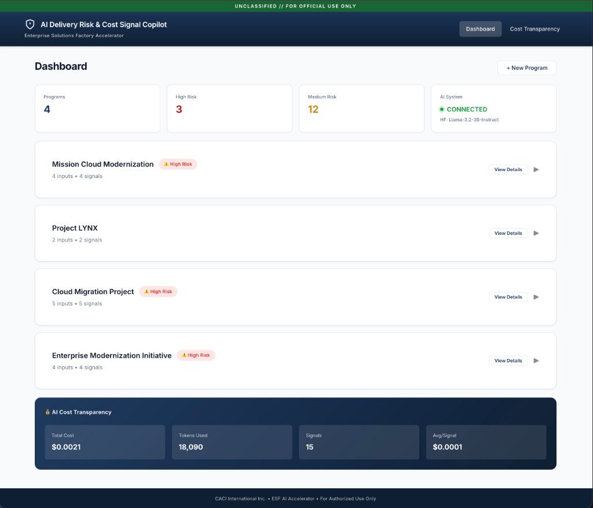

# CACI AI Delivery Risk & Cost Signal Copilot

An ESF-aligned AI accelerator that surfaces early delivery risk, cost anomalies, and AI usage efficiency signals across government programs.



## Overview

This project is a **high-leverage Enterprise Solutions Factory (ESF) accelerator** designed to demonstrate rapid time-to-value, cost transparency, explainability, and human-in-the-loop decision support.

**Key Question Answered:** "Are we trending toward risk or cost issues — and why?"

### Features

- **Program Input Ingestion** - CSV/TXT uploads, manual text entry
- **AI-Assisted Signal Generation** - Delivery risk, cost risk, and AI efficiency signals
- **Cost Transparency** - Token usage tracking, cost-per-signal metrics
- **Human-in-the-Loop Controls** - Analyst overrides with mandatory justification
- **Audit Trail** - Full history of AI outputs and human corrections

## Quick Start

### Prerequisites
- Python 3.9+
- Node.js 18+
- (Optional) Hugging Face API key for AI features

### Backend Setup

```bash
cd backend
pip install -r requirements.txt
python run.py
```

The API will be available at `http://localhost:8000`
- API docs: `http://localhost:8000/api/docs`

### 3. Setup Hugging Face (Real AI Mode)
To use the real AI model instead of demo fallback:
1. **Create Account**: Go to [huggingface.co](https://huggingface.co/) and sign up.
2. **Generate Token**:
   - Go to **Settings** > **Access Tokens**.
   - Click **New token**.
   - Name it (e.g., `CACI-API-Copilot`).
   - **IMPORTANT**: 
     - Option A (Easiest): Select **Classic** as the token type and choose **Read**.
     - Option B: Select **Fine-grained** and ensure you check the **"Make calls to Inference Providers"** permission.
   - Click **Generate token**.
3. **Configure API**:
   - Open `backend/.env`.
   - Paste your token into `HUGGINGFACE_API_KEY=your_token_here`.
4. **Restart Backend**: Restart the python service to apply changes.

### Frontend Setup

```bash
cd frontend
npm install
npm run dev
```

The UI will be available at `http://localhost:5173`

### Environment Variables

Copy `backend/.env.example` to `backend/.env` and configure:

```env
# Optional - fallback mode works without it
HUGGINGFACE_API_KEY=your_key_here

# Database (defaults to SQLite)
DATABASE_URL=sqlite:///./data/copilot.db
```

## Architecture

```
┌─────────────────┐      ┌─────────────────┐
│   React + Vite  │◄────►│    FastAPI      │
│   (Frontend)    │      │    (Backend)    │
└─────────────────┘      └────────┬────────┘
                                  │
                    ┌─────────────┼─────────────┐
                    │             │             │
              ┌─────▼─────┐ ┌─────▼─────┐ ┌─────▼─────┐
              │  SQLite/  │ │ Hugging   │ │ Services  │
              │ PostgreSQL│ │ Face API  │ │  Layer    │
              └───────────┘ └───────────┘ └───────────┘
```

### Tech Stack

| Component | Technology |
|-----------|------------|
| Frontend | React 18, Vite, React Router |
| Backend | FastAPI, SQLAlchemy, Pydantic |
| Database | SQLite (default), PostgreSQL (optional) |
| AI | Hugging Face Inference API |

## Sample Data

The `sample_data/` directory includes realistic test files:

| File | Description |
|------|-------------|
| `weekly_status_report.txt` | Program status with milestones and blockers |
| `program_risk_register.csv` | Risk tracking with likelihood/impact |
| `cost_burn_summary.csv` | Budget vs. actual spend |
| `delivery_milestones.csv` | Schedule tracking |
| `ai_usage_log.csv` | AI model invocation history |
| `analyst_notes.txt` | Free-form analyst observations |

## ESF Alignment

This accelerator embodies ESF principles:

| Principle | Implementation |
|-----------|----------------|
| **High-Leverage** | 60-70% solution, not a complete platform |
| **Cost Transparency** | Every AI call logged with token/cost metrics |
| **Human-Centered** | AI labeled as "assistive", override capability |
| **Explainability** | Natural language explanations for all signals |
| **Simplicity** | SQLite default, no auth, minimal dependencies |

## API Endpoints

### Programs
- `GET /api/programs` - List all programs
- `POST /api/programs` - Create program
- `GET /api/programs/{id}` - Get program details

### Inputs
- `POST /api/inputs/program/{id}/upload` - Upload file
- `POST /api/inputs/program/{id}/manual` - Manual text input

### Signals
- `GET /api/signals` - List signals with filters
- `POST /api/signals/analyze/program/{id}` - Generate signals

### Overrides
- `POST /api/overrides/signal/{id}` - Submit analyst override

### Costs
- `GET /api/costs/summary` - Cost transparency metrics

## Non-Goals

Per ESF philosophy, this accelerator intentionally does **not** include:
- Authentication/authorization
- Production security hardening
- Real-time streaming
- Model training/fine-tuning
- Cloud deployment configurations

## License

Internal CACI use only.
